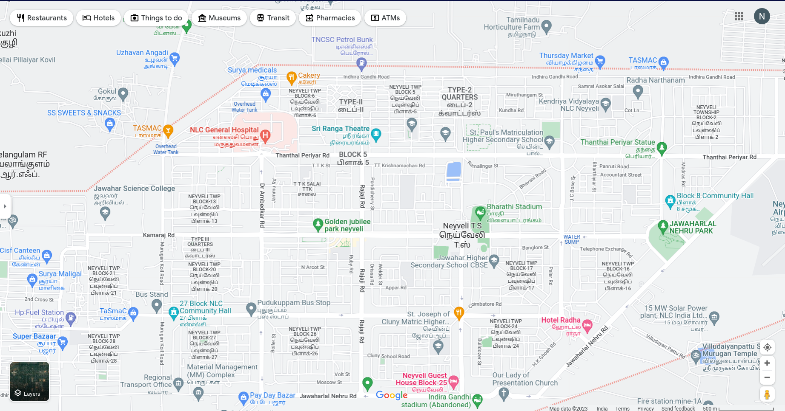
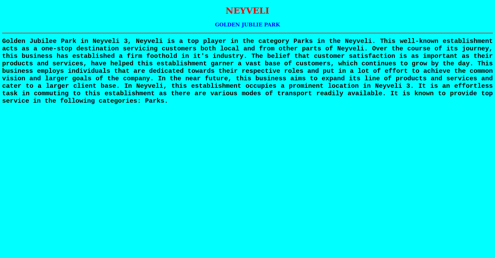
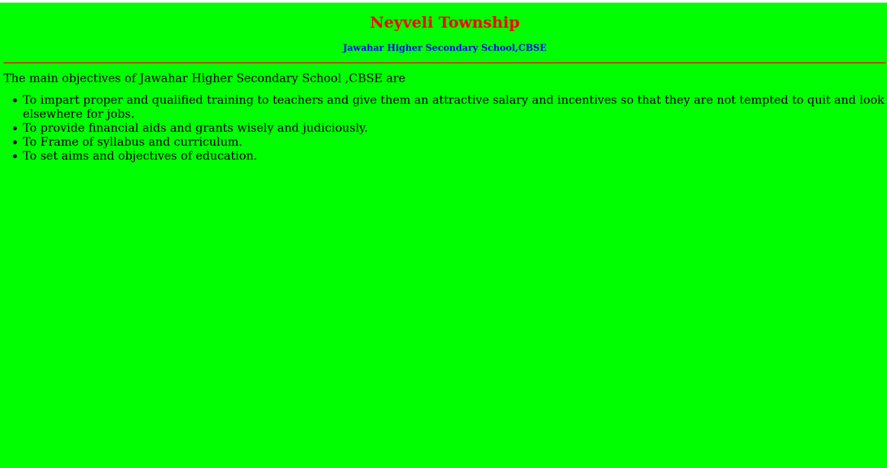
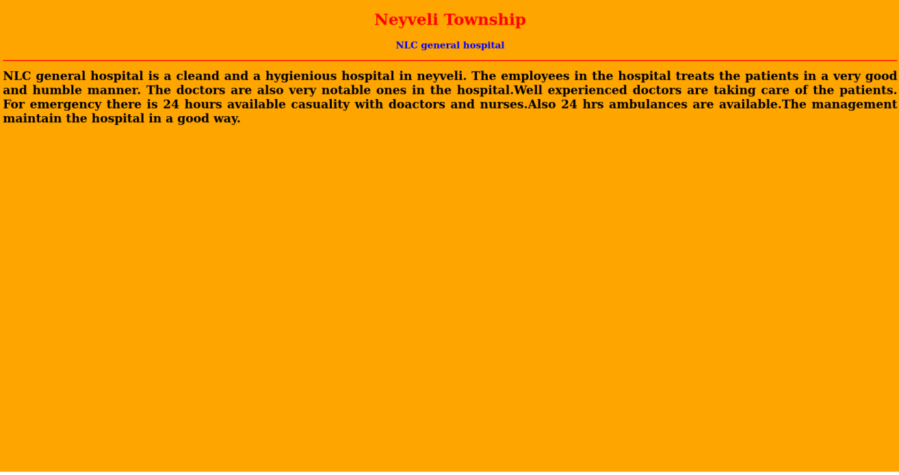
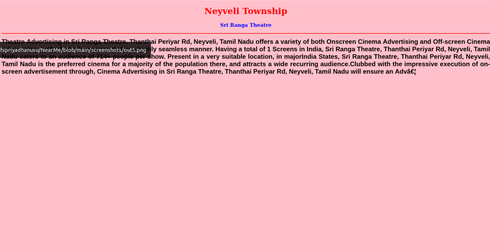
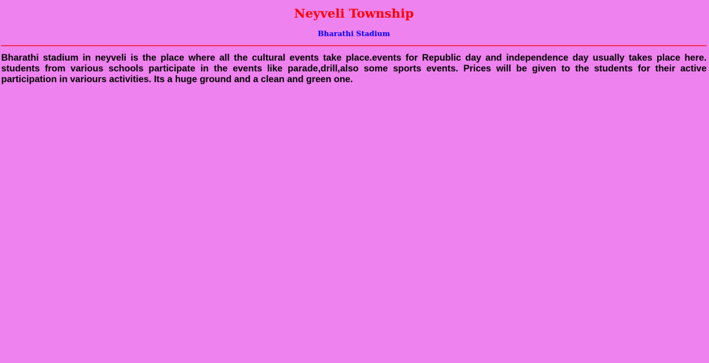
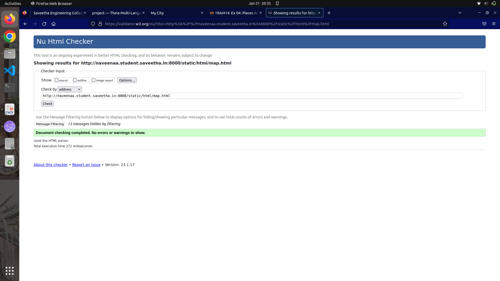

# Places Around Me
## AIM:
To develop a website to display details about the places around my house.

## Design Steps:

### Step 1:

Clone the github repository into Theia IDE.

### Step 2:

create a new Django project.

### step 3:

write the needed html code.

### step 4:

Run the Django server and execute the HTML files.

## Code:
``` 
map.html 

<!DOCTYPE html>
<html lang="en">
<head>
<title>My City</title>
</head>
<body>
<h1 align="center">
<font color="red"><b>NEYVELI</b></font>
</h1>
<h3 align="center">
<font color="blue"><b>NAVEENAA (22003091)</b></font>
</h3>
<center>

<map name="MyCity">
<area shape="circle" coords="190,50,20" href="/static/html/ghs.html" title="Govt. Higher Secondary School">
<area shape="rectangle" coords="230,30,260,60" href="/static/html/rto.html" title="RTO Office">
<area shape="circle" coords="400,350,50" href="/static/html/vk.html" title="Washerman's Lake">
<area shape="circle" coords="400,200,75" href="/static/html/bus.html" title="Hi-Tech Bus Stand">
<area shape="rectangle" coords="490,150,870,320" href="/static/html/park.html" title="Eco-Park">
</map>
</center>
</body>
</html>

bus.html

<!DOCTYPE html>
<html lang="en">
<head>
<title>Bus Stand</title>
</head>
<body bgcolor="cyan">
<h1 align="center">
<font color="red"><b>NEYVELI</b></font>
</h1>
<h3 align="center">
<font color="blue"><b>GOLDEN JUBLIE PARK</b></font>
</h3>
<hr size="3" color="red">
<p align="justify">
<font face="Courier New" size="5">
<b>Healthcare is something that can't be compromised, can it? Hospitals have a huge role to play in developing the healthcare system of any country because, with a growing population, the healthcare demands too are growing and evolving. Providing the highest standard of care for both, minor and major health issues, hospitals create a safe space for the patients by offering end-to-end clinical, surgical, and diagnostic services.
Hospitals have been making healthcare accessible to one and all and Government General Hospital in Neyveli Gh, Neyveli is one such reliable hospital that is committed to providing expert medical care. Having established a firm presence as a trusted name in Public Hospitals, it is renowned for offering specialised services and treatments
</b>
</font>
</p>
</body>
</html>

park.html

<!DOCTYPE html>
<html lang="en">
<head>
<title>GOLDEN JUBLIE PARK</title>
</head>
<body bgcolor="yellow">
<h1 align="center">
<font color="PINK"><b>NEYVELI</b></font>
</h1>
<h3 align="center">
<font color="blue"><b>GOLDEN JUBLIE PARK</b></font>
</h3>
<hr size="3" color="red">
<p align="justify">
<font face="Tahoma" size="5">

Golden Jubilee Park in Neyveli 3, Neyveli is a top player in the category Parks in the Neyveli. This well-known establishment acts as a one-stop destination servicing customers both local and from other parts of Neyveli. Over the course of its journey, this business has established a firm foothold in it's industry. The belief that customer satisfaction is as important as their products and services, have helped this establishment garner a vast base of customers, which continues to grow by the day. This business employs individuals that are dedicated towards their respective roles and put in a lot of effort to achieve the common vision and larger goals of the company. In the near future, this business aims to expand its line of products and services and cater to a larger client base. In Neyveli, this establishment occupies a prominent location in Neyveli 3. It is an effortless task in commuting to this establishment as there are various modes of transport readily available. It is known to provide top service in the following categories: Parks.

</font>
</p>
</body>
</html>

rto.html

<!DOCTYPE html>
<html lang="en">
<head>
<title>RTO Office</title>
</head>
<body bgcolor="pink">
<h1 align="center">
<font color="red"><b>NEYVELI</b></font>
</h1>
<h3 align="center">
<font color="blue"><b>RTO Office</b></font>
</h3>
<hr size="3" color="red">
<p align="justify">
<font face="Arial" size="5">
<b>
RTO office or the Regional Transport Office is a government body specifically established to oversee all transport-related operations in the country. RTOs are located throughout the country in each state and union territory. RTOs are responsible for enforcing the rules as laid down by the Motor Vehicle Act of 1988.
The department also maintains a database of all the vehicles operating in the country as well as issues licenses for drivers. Besides, the RTO office also collects road taxes, supervises pollution checks, and ensures the enforcement of all road transportation rules. If you own or drive a vehicle in India, you will need to visit the RTO to get your vehicle registered, obtain a driver’s license or renew your driver’s license, etc.
RTOs are also responsible for improving road and vehicle safety, especially to avoid accidents and other road fatalities.
</b>
</font>
</p>
</body>
</html>


ghs.html

<!DOCTYPE html>
<html lang="en">
<head>
<title>ST.JOSEPH OF CLUNY MATRIC</title>
</head>
<body bgcolor="lime">
<h1 align="center">
<font color="red"><b>NEYVELI/b></font>
</h1>
<h3 align="center">
<font color="blue"><b>ST JOSEPH OF CLUNY MATRIC Higher Secondary School</b></font>
</h3>
<hr size="3" color="red">
<p align="justify">
<font face="Georgia" size="5">
The main ST. Joseph Of CLUNY Matriculation Higher Secondary School are 
<ul>
<li>To impart proper and qualified training to teachers and give them an attractive salary and incentives so that they are not tempted to quit and look elsewhere for jobs.</li>
<li>To provide financial aids and grants wisely and judiciously.</li>
<li>To Frame of syllabus and curriculum.</li>
<li>To set aims and objectives of education.</li>
</ul>
</font>
</p>
</body>
</html>


vk.html

<!DOCTYPE html>
<html lang="en">
<head>
<title>Washerman’s Lake</title>
</head>
<body bgcolor="orange">
<h1 align="center">
<font color="red"><b>NEYVELI</b></font>
</h1>
<h3 align="center">
<font color="blue"><b>Washerman's Lake</b></font>
</h3>
<hr size="3" color="red">
<p align="justify">
<font face="Georgia" size="5">
The uses of Washerman's Lake in CUDDALORE District are 
<ol type="1">
<li>Lake is used for rain water harvesting.</li>
<li>It is used for drinking.</li>
<li>Pisculture.</li>
<li>For bathing, washing clothes etc.</li>
</ol>
</font>
</p>
</body>
</html>
```
## Output:












## HTML VAILDATOR:


## Result:

The program for implementing image map is executed successfully.
